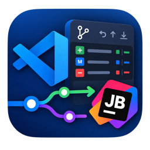

<a name="readme-top"></a>

<div align="center">



<h1>JetBrains Git Control</h1>

<strong>最完整的 IntelliJ IDEA / JetBrains Git 体验，适用于 VS Code 和 Cursor</strong>

[](./LICENSE)
[](https://code.visualstudio.com/)
[](./package.json)

> **注意**：本项目 fork 自 [JetBrains Git - IntelliJ IDEA Git Graph, Commit & Shelf for VS Code](https://github.com/aotemj/jetbrains-git-graph)，新增了 inline git blame 注解和提交图导航功能。

> Fork 自 [zhyc9de/jet-git](https://github.com/zhyc9de/jet-git)，包含完整的 IntelliJ IDEA 风格右键菜单和 UI 增强。

[English](./README.md) · **简体中文**

</div>

---

## 功能特性

### 内联 Git Blame 注解

WebStorm 风格的行内 blame 注解，支持点击跳转到 Git Log 提交图。

- **显示模式**：全文件 / 仅光标行 / 光标前后 N 行
- **可配置列**：revision、date、author、commitNumber（按需选择）
- **命名风格**：缩写、姓氏、名字、全名、邮箱
- **年龄着色**：按提交新旧程度渐变着色（新→蓝、中→绿、旧→灰）
- **左对齐**：未注解行也向右对齐，保持代码整洁

### 分支右键菜单

右键任意分支即可执行 Checkout、创建、合并、Rebase、重命名、删除、Push、Pull 等操作，与 IntelliJ IDEA 体验一致。


### 提交右键菜单

右键任意提交即可复制 Hash、Cherry-Pick、Checkout、Reset、Revert、创建分支或标签。


### 变更文件右键菜单

右键变更文件面板中的文件：查看 Diff、编辑源文件、打开仓库版本、还原/Cherry-Pick 文件变更、复制路径。

### Git 提交图


- **分支树** — 按 Local / Remote / Tags 分组，支持搜索过滤
- **提交列表** — 彩色分支线，可调整列宽（Message、Author、Date、Hash）
- **详情面板** — 提交信息和变更文件树
- **过滤器** — 按分支、作者、日期范围过滤

### 三路合并编辑器


- 三栏布局：Theirs | Result | Yours
- 冲突高亮 + 逐块操作按钮
- 完整语法高亮

### 冲突管理


- 快捷操作：接受 Yours / 接受 Theirs / 合并
- 与 VS Code 源代码管理面板无缝集成

### Git Worktree

JetBrains 风格的工作树管理面板，位于 Activity Bar 侧边栏。

- **工作树列表** — 查看所有工作树，显示分支和路径列
- **新建工作树** — 可搜索的分支/标签下拉（本地 + origin/*），支持输入校验和自动填充
- **打开项目** — 双击打开，弹出原生 VS Code 对话框（当前窗口 / 新窗口）
- **清理** — 使用 JetBrains clearCash 图标清理过期工作树元数据
- **侧边栏折叠** — 切换工具栏可见性
- **配置项** — `jgc.worktree.openBehavior`：ask（默认）/ thisWindow / newWindow

---

## 所有右键菜单操作

<details>
<summary><b>分支（右键）</b></summary>

- Checkout — 切换分支
- New Branch from... — 从选中分支创建新分支
- Checkout and Rebase onto current — 切换并 Rebase 到当前分支
- Rebase current onto branch — 将当前分支 Rebase 到选中分支
- Merge into current — 合并到当前分支
- Rename — 重命名（仅本地分支）
- Delete — 删除（未合并时提示强制删除）
- Update — 拉取远程更新
- Push — 推送到远程

</details>

<details>
<summary><b>提交（右键）</b></summary>

- Copy Revision Number — 复制完整 Hash
- Cherry-Pick — Cherry-Pick 该提交
- Checkout Revision — 切换到该提交（Detached HEAD）
- Reset Current Branch to Here — 重置当前分支（Mixed/Soft/Hard）
- Revert Commit — 创建 Revert 提交
- New Branch... — 从该提交创建分支
- New Tag... — 在该提交创建标签

</details>

<details>
<summary><b>变更文件（右键）</b></summary>

- Show Diff — 打开 Diff 编辑器
- Edit Source — 在编辑器中打开文件
- Open Repository Version — 查看该提交时的文件版本
- Revert Selected Changes — 还原文件到父提交状态
- Cherry-Pick Selected Changes — 将文件变更应用到工作区
- Copy Path — 复制文件路径
- Copy File Name — 复制文件名

</details>

---

## 配置

在 VS Code 设置中搜索 `JGC`：

| 配置项 | 说明 | 默认值 |
|--------|------|--------|
| `jgc.blame.enabled` | 启用内联 blame 注解 | `true` |
| `jgc.blame.columns` | 显示的列 | `["revision", "author", "date"]` |
| `jgc.blame.colorMode` | 着色模式 | `order` |
| `jgc.blame.nameStyle` | 名称显示风格 | `lastName` |
| `jgc.blame.displayMode` | 显示范围 | `full` |
| `jgc.blame.aroundLines` | 上下文行数（around 模式） | `5` |
| `jgc.blame.dateFormat` | 日期格式 | `yyyy-MM-dd HH:mm` |
| `jgc.worktree.openBehavior` | 从工作树打开项目的方式 | `ask` |

---

## 安装

**从 Marketplace 安装：**

在 VS Code 扩展中搜索 **"JetBrains Git Control"** 或 **"JGC"** 即可安装。

**从 .vsix 安装：**

1. 从 [Releases](https://github.com/witt-bit/jetbrains-version-control/releases) 下载最新 `.vsix`
2. `Cmd+Shift+P` → "Extensions: Install from VSIX..."

## 环境要求

- VS Code 1.85.0+
- Git 已安装并在 PATH 中

## 本地开发

```bash
git clone https://github.com/witt-bit/jetbrains-version-control.git
cd jetbrains-version-control
pnpm install
cd webview && pnpm install && cd ..
```

按 **F5** 启动扩展开发宿主。

```bash
pnpm run watch          # 监听模式
pnpm run build          # 生产构建
pnpm run vsce:package   # 打包为 .vsix
```

## 致谢

- 原项目：[aotemj/jetbrains-git-graph](https://github.com/aotemj/jetbrains-git-graph)
- Fork 来源：[zhyc9de/jet-git](https://github.com/zhyc9de/jet-git)
- 图标：[IntelliJ IDEA Icons](https://intellij-icons.jetbrains.design/)（Apache 2.0 许可）

## 许可证

[MIT](./LICENSE)
